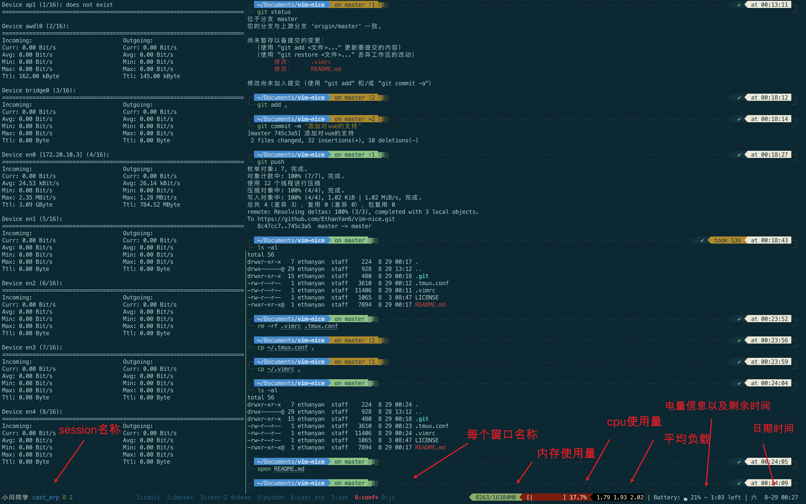

# vim-nice

> 作者：小闫同学

## 1.说明

[vim使用教程](https://www.pythonnote.cn/vim操作有这一篇就足够了/)

[vim包管理工具vundle使用教程](https://www.jianshu.com/p/c7ac15bc4883)

懒人配置vim方案，现成的 `.vimrc` 配置文件，仅需按照步骤安装即可。

此 `.vimrc` 中安装了一些常用的插件，如目录树、函数列表、文件搜索等等，大家可以根据需要，结合配置文件中注释内容，删除掉不需要的插件。（比如小闫同学写 `js` 、 `python` ，以及 `go` ，所以偏向这三者，有这三者的语法高亮、格式检查插件，如果你不需要，完全可以删除相应内容。） 

The lazy person configures the vim scheme, with detailed instructions, and the ready-made `.vimrc` configuration file for use.

> 更多精彩内容，请关注微信公众号【Pythonnote】或者【全栈技术精选】<br> 请收藏个人网站 pythonnote.cn


## 2.步骤

### 2.1 安装包管理工具

```shell
git clone https://github.com/VundleVim/Vundle.vim.git ~/.vim/bundle/Vundle.vim 
```

### 2.2 下载最经典的vim配色方案(选)

> 如果想使用此主题，按照下方步骤下载好后，打开 `.vimrc` 中下面代码的注释(删除代码前的双引号)即可使用：
>
> ```shell
> "colorscheme molokai
> ```

1.克隆所需仓库文件

```shell
git clone https://github.com/tomasr/molokai.git ~/.vim/colors
```

2.移动文件

```shell
mv ~/.vim/colors/colors/molokai.vim ~/.vim/colors
```

> 将克隆下来的代码中 `molokai.vim` 放到 `vim` 可读取配置的目录内（`~/.vim/colors`）。

3.删除无用文件

```shell
cd ~/.vim/colors
rm -rf colors README.md LICENSE.md
```

> `colors` 中有用的文件我们已经移除，这个空目录可以删除；`README.md` 是说明文件；`LICENSE.md` 是授权说明文件。

### 2.3 安装搜索命令ag

> 配合 `vim` 插件 `ag.vim` 使用

#### 2.3.1 Ubuntu

```shell
sudo apt-get install silversearcher-ag
```

#### 2.3.2 CentOS

```shell
yum install epel-release
yum -y install the_silver_searcher
```

#### 2.3.3 Mac

```shell
brew install the_silver_searcher
```

### 2.4 安装 ctags

> 配合 `vim` 插件 `tagbar` 使用

#### 2.4.1 Mac

1.安装

```
# MAC
brew install ctags-exuberant
```

> 因为 `mac` 系统中自带了一个老版本的 `ctags`，我们需要一个新版本的，并且让 `vim` 识别到我们新下载的内容，所以需要安装后，添加配置。

2.创建文件识别我们安装的 `ctags`

```shell
vim ~/.profile
```

3.添加一句话：

```shell
export PATH="/usr/local/bin:/usr/local/sbin:$PATH"
```

4.保存后，终端刷新一下这个文件：

```shell
source ~/.profile
```

#### 2.4.2 Ubuntu

1.安装

```shell
# Ubuntu
sudo apt install ctags
```

2.将仓库中 `.vimrc` 中第67行内容中 `ctags` 命令的路径修改为下列内容

```shell
let g:tagbar_ctags_bin='/usr/bin/ctags'
```

### 2.5 安装代码格式化插件

1.配合 `vim` 插件 `vim-autopep8` 使用，可以自动格式化 `python` 代码

```shell
sudo pip3 install autopep8
```

> `sudo` 是因为需要给全局安装，而不是当前用户安装

2.配合 `vim` 插件 `vim-flake8` 使用，可以提示 `python` 代码错误并给出修改意见。

```shell
sudo pip3 install flake8
```

3.配合 `vim` 插件 `vim-prettier` 使用，可以格式化前端代码。

```shell
sudo npm install -g prettier
```

4.配合 `vim` 插件 `jedi-vim` 使用，可以对 `python` 代码进行补全以及跳转。

```shell
pip install jedi
```

5.配合 `vim-vue` 使用

```shell
npm i -g eslint eslint-plugin-vue 
```

### 2.6 用仓库中.vimrc文件替换掉电脑中的同名配置文件

1.将 `.vimrc` 放到家目录 `~/` 下

2.使用 `vim` 打开 `.vimrc`

```shell
vim ~/.vimrc
```

3.使用包管理器安装配置文件中的插件

> 安装插件之前大家可以根据注释内容，删除掉不需要的插件

```shell
:PluginInstall
```

> 上述命令在 `vim` 的命令模式下输入。输入完后回车，耐心等待下载，插件比较多耗时比较长。如果下载完成后，底部状态行会显示 `Done!`

### 2.7 注意

~1.如果报错：The ycmd server SHUT DOWN (restart with ...low the instructions in the documen~ 

~**解决方法**：~ 


~cd \~/.vim/bundle/YouCompleteMe~ 

~./install.py~ 


2.如果报错：ERROR: Unable to find executable 'cmake'. CMake is required to build ycmd

**解决办法**：

```shell
# Ubuntu
sudo apt install cmake
# Mac
brew install cmake
```

3.如果 `Ubuntu` 用户使用 `xshell` 等工具连接服务器后，打开 `vim` 发现鼠标右键没用了，无法复制粘贴。

**解决办法**：将仓库 `.vimrc` 中第203行 `set mouse`  部分改为下列代码：

```shell
set mouse=c
```

4.如果安装完后颜色显示与图片中不一致，状态栏颜色也是黑色，那么可以考虑使用如下方法解决。

**解决方法**：

```shell
vim ~/.vimrc
# 添加如下信息
set t_Co=256
```

5.如果使用 `macvim` 软件的同学可能在升级新版本后，打开 `html/xml` 文件时报错，提示无法打开 `**/closetag.vim`，可以将下面目录中的文件：

```shell
~/.vim/bundle/closetag.vim/plugin/closetag.vim
```

移动到大概下方的位置：

```shell
/usr/local/Cellar/macvim/8.2-166/MacVim.app/Contents/Resources/vim/runtime/plugin
```

### 2.8 部分插件使用说明

#### 2.8.1 `nerdtree`

```shell
o   : 打开节点或者打开文件（打开文件的时候，光标会跑到文件中）
go  : 打开节点或者打开文件（打开文件的时候，光标在目录树中）
p   : 到上级目录
P   : 到根目录
?   : 帮助
q   : 关闭
K   : 到同级目录的第一个节点
J   : 到同级目录的最后一个节点
i   : 水平分割预览
s   : 垂直分割预览
t   : 打开一个 tab 页并跳转过去
T   : 打开一个新的 tab 页不跳转过去
M   : 菜单中，选择添加子节点即可添加目录或者文件
r   : 刷新光标所在目录
R   : 刷新当前根路径
C   : 将根路径设置为光标所在的目录
u   : 设置上级目录为根路径
U   : 设置上级目录为跟路径，但是维持原来目录打开的状态
```

#### 2.8.2 `vim-easymotion`

```shell
\\s    快速查找移动，按显示的字母即可跳转
\\w    光标后跳转单词
\\b    光标前跳转单词
\\k    光标前的行
\\j    光标后的行
```

#### 2.8.3 `vim-prettier`

```shell
<leader>+p  : 格式化
```

#### 2.8.4 `ctrlp.vim`

```shell
Ctrl + p         搜索文件
        ctrl + j/k  进行上下选择
        ctrl + x    在当前窗口水平分屏打开文件 
        ctrl + v    同上, 垂直分屏 
        ctrl + t    在tab中打开
```

#### 2.8.5 `ctrlp-funky`

```shell
\fu    函数列表
\fU    搜索当前光标所在单词的函数
       ctrl + j/k  进行上下选择
       Enter       跳转到函数
```

需要在 `.vimrc` 中设置如下代码（仓库中的 `.vimrc` 已设置）：

```shell
" fu 进入当前文件的函数列表搜索
" fU 搜索当前光标下单词对应的函数
nnoremap <Leader>fu :CtrlPFunky<Cr>
" narrow the list down with a word under cursor
nnoremap <Leader>fU :execute 'CtrlPFunky ' . expand('<cword>')<Cr>
let g:ctrlp_funky_matchtype = 'path'
let g:ctrlp_funky_syntax_highlight = 1
```

#### 2.8.6 `ag.vim`

搜索包含 xxx 内容的文件： 

```shell
:Ag! xxx
```

#### 2.8.7 `tagbar`

按 `F9` 打开关闭函数视图预览 `bar`

> 需要进行如下的设置（本仓库中 `.vimrc` 已设置）

```shell
" tagbar 的配置
nmap <F9> :TagbarToggle<CR>
```

#### 2.8.8 `vim-autopep8`

```shell
" autopep8配置 
autocmd FileType python noremap <buffer> <F8> :call Autopep8()<CR>
```

#### 2.8.9 `c.vim` 

在 `.vimrc` 中添加 `filetype plugin on` 语句后，每次打开 `.c` 文件，都会自动插入表头：

```c
/*
 * =====================================================================================
 *
 *       Filename:  test_c_vim.c
 *
 *    Description:  测试 c.vim 插件的使用
 *
 *        Version:  1.0
 *        Created:  2020/10/04 22时43分09秒
 *       Revision:  none
 *       Compiler:  gcc
 *
 *         Author:  Ethan Yan (小闫同学), ethanyanisme@gmail.com
 *   Organization:  https://www.pythonnote.cn
 *
 * =====================================================================================
 */
```

可以通过修改如下文件对表头注释进行自定义

```shell
vim ~/.vim/bundle/c.vim/c-support/templates/Templates

$ =============================================================
$ ========== USER MACROS ======================================
$ =============================================================
$
|AUTHOR|    = Ethan Yan 
|AUTHORREF| = 小闫同学
|EMAIL|     = ethanyanisme@gmail.com 
|COMPANY|   = https://www.pythonnote.cn
|COPYRIGHT| = Copyright (c) |2020|, |Ethan Yan|
|STYLE|     = default
|ORGANIZATION| = https://www.pythonnote.cn
```

> 根据自己电脑情况，如果某些配置项没有，可以自己添加。比如 `ORGANIZATION`

**快捷键**

**`\if`** 插入函数

```c
    /* 插入函数 \if */

    /* 
     * ===  FUNCTION  ======================================================================
     *         Name:  myfuction
     *  Description:  
     * =====================================================================================
     */
    void
        myfuction ( <+argument list+> )
        {
            return <+return value+>;
        }		/* -----  end of function myfuction  ----- */
```

**`\im`** 插入 main 函数

```c
    /* 插入 main 函数 \im */
    
    #include	<stdio.h>

    /* 
     * ===  FUNCTION  ======================================================================
     *         Name:  main
     *  Description:  
     * =====================================================================================
     */
    int
        main ( int argc, char *argv[] )
        {
            return EXIT_SUCCESS;
        }				/* ----------  end of function main  ---------- */
```

**`\cfu`** 插入函数头

```c
    /* 插入函数头 \cfu */

    /* 
     * ===  FUNCTION  ======================================================================
     *         Name:  test_cfu
     *  Description:  kk
     * =====================================================================================
     */
```

**`\cfr`** 添加一个注释块

```c
    /* 添加一个注释块 \cfr */
    
    /*-----------------------------------------------------------------------------
     *  test
     *-----------------------------------------------------------------------------*/

```

**`\p<`** 插入包含(include)一个头文件

```c
    /* 包含(include)一个头文件 \p< */

    #include <>

```

**`\rc`** 保存后编译

#### 2.9.0 jedi-vim

默认配置快捷键

```shell
let g:jedi#goto_command = "<leader>d"
let g:jedi#goto_assignments_command = "<leader>g"
let g:jedi#goto_definitions_command = ""
let g:jedi#documentation_command = "K"
let g:jedi#usages_command = "<leader>n"
let g:jedi#completions_command = "<C-Space>"
let g:jedi#rename_command = "<leader>r"
```

本配置文件应用后，自动补全快捷键变为了 `<C-N>`

需要根据本人的 python 环境配置 python 的路径，在配置文件的第 151 行：

```shell
let g:jedi#environment_path = '/usr/local/bin/python3.9'
```

>   配置项的值更改为你电脑上的 python 路径

## 3.tmux配置过程

[tmux使用教程](https://www.pythonnote.cn/Tmux让你开发效率飞起/)



### 3.1 下载tmux包管理工具

```shell
git clone https://github.com/tmux-plugins/tpm ~/.tmux/plugins/tpm
```

`Tmux-plugins` 集合：https://github.com/tmux-plugins

### 3.2 系统命令预备下载

1.`tmux-urlview` 插件需要安装 `urlview` 命令。

```shell
# Mac
brew install urlview
```

> 此插件可以寻找 `tmux` 中出现的所有的 `url` ，通过 `ctrl-b + u` 列出所有链接，然后回车直接用浏览器打开。

2.`tmux-mem-cpu-load` 插件需要安装命令：

```shell
# Mac
brew install tmux-mem-cpu-load
```

右下角显示的结果说明：

```shell
  2885/7987MB [|||||     ]  51.2% 2.11 2.35 2.44

   ^    ^          ^         ^     ^    ^    ^
   |    |          |         |     |    |    |
   1    2          3         4     5    6    7
   
1. Currently used memory.
2. Available memory.
3. CPU usage bar graph.
4. CPU usage percentage.
5. Load average for the past minute.
6. Load average for the past 5 minutes.
7. Load average for the past 15 minutes.
```

> `load average` 显示的是最近1分钟、5分钟和15分钟的系统平均负载
>
> 如果底部栏右侧显示方框小问号，可以下载此字体 [powerline-font](https://github.com/powerline/fonts)

### 3.3 将该仓库中 .tmux.conf 放到家目录下

如果你的家目录下存在同名文件，则替换为该仓库中的 `.tmux.conf` 文件。

### 3.3 安装配置文件中的插件

1.进入 `tmux` 中，使用 `ctrl-b` 加上 `I` ，安装插件。

> 配置文件有三个重要插件：一个显示剩余电量，一个显示 `CPU` 使用率，一个可以持久化保存当前所有窗口配置。

2.**持久化保存当前 `tmux` 所有窗口配置**：

> 保存内容包括：界面中所有命名 `Window`，每个 `Window` 中分割的 `Panel`，以及每个 `Panel` 中的路径。

使用如下命令保存：

```shell
<ctrl-b> + <ctrl-s>
```

断电或电脑关机重启后，先进入 `tmux`，然后使用如下命令恢复：

```shell
<ctrl-b> + <ctrl-r>
```

### 3.5 注意

1.如果进入 `tmux` 中打开 `vim` 时，发现状态栏以及背景等**颜色不正常**

**解决方法**：

使用 `tmux -2` 命令启动。

> 之前我们都是使用 `tmux` 开启并进入到多窗口页面，现在添加参数 `-2`

2.如果使用 `ubuntu` 系统的话，有可能你会发现进入 `tmux` ，鼠标右键无法使用复制粘贴功能，弹出来的菜单是 `tmux` 的帮助菜单。

**解决办法**：在 `tmux` 中先按 `prefix` （ 也就是`Ctrl + B`），然后按冒号，输入如下内容：

```shell
# 2.1版本之后
: set -g mouse off 
# 2.1版本之前
: set -g mode-mouse off
```

